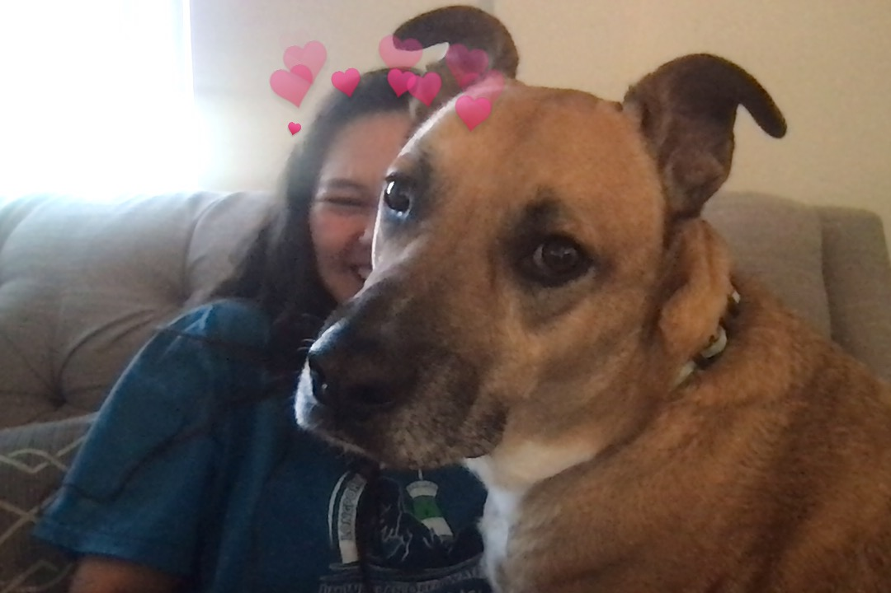

# This is Emily's awesome website


Here's some text. I use [google](https://translate.google.com/) to do data science.

This is a photo of Daisy:



```{r}
library(tidyverse)
```

Direct link to About page:
[about](about.html)

